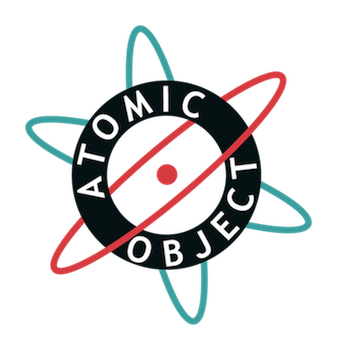

!SLIDE 
# Embedded test-driven development in C with Ruby #

!SLIDE center
# Matt Fletcher #
# Atomic Object #

!SLIDE
# latest version at #
## [http://fletcherm.github.com/glsec_2011](http://fletcherm.github.com/glsec_2011) ##

!SLIDE
# Context #

!SLIDE
# Big government agency wants some training #

!SLIDE
# TDD and unit testing #

!SLIDE bullets
# Tools #
* [Ceedling](http://throwtheswitch.org/white-papers/ceedling-intro.html)
* [Unity](http://throwtheswitch.org/white-papers/unity-intro.html)
* [CMock](http://throwtheswitch.org/white-papers/cmock-intro.html)
* [CException](http://throwtheswitch.org/white-papers/cexception-intro.html)

!SLIDE
# The usual process #

!SLIDE
# Simple GUI calculator example #

!SLIDE
# Red #

!SLIDE smaller
    @@@ C
    void test_ApplicationPresenter_
              AllowsNumbersToBeEnteredForTheDivisor() {

      ApplicationView_GetDivisor_ExpectAndReturn("21");

      ApplicationModel_CheckArgumentFormat
                      _ExpectAndReturn("21", "3", TRUE);
    
      ApplicationPresenter_DivisorChangedCallback("3");
    }

!SLIDE smaller
    @@@ C
    void test_ApplicationPresenter_
              DoesNotAllowNonNumbersToBeEnteredForTheDivisor() {

      ApplicationView_GetDivisor_ExpectAndReturn("21");

      ApplicationModel_CheckArgumentFormat
                      _ExpectAndReturn("21", "j", FALSE);

      ApplicationView_UndoDivisorTextChange_Expect();
    
      ApplicationPresenter_DivisorChangedCallback("j");
    }

!SLIDE
# Green #

!SLIDE smaller
    @@@ C
    void ApplicationPresenter_
         DivisorChangedCallback(char* new_text) {

      if (ApplicationModel_CheckArgumentFormat(
          ApplicationView_GetDivisor(), new_text) == FALSE) {

        ApplicationView_UndoDivisorTextChange();
      }
    }

!SLIDE
# Refactor #

!SLIDE smaller bullets
* nothing needed here because it's already awesome!

!SLIDE
# upside #

!SLIDE
# it's tested #

!SLIDE
# good day, bad day, corner cases covered #

!SLIDE
# we know each component works..._in isolation_ #

!SLIDE
# we need to know if these components cooperate #

!SLIDE
# Let's take TDD even further #

!SLIDE bullets incremental
Sample project
==============
* client - server apps
* put and get (pid, name) tuples for an id
* cucumbers for both client and server
* use cucumbers to guide features, use ceedling tools to guide development

!SLIDE
# TDD at the system level with Cucumber #

!SLIDE
# Bring in Ruby and Cucumber to help #

!SLIDE
# slightly modified workflow #

!SLIDE
# Feature: client can ping the server #

!SLIDE
# Red system test #

!SLIDE
# Write a test in Gherkin #

!SLIDE code
    Feature: Ping command
    As a server
    I want to respond to clients 
      wondering if I'm online

!SLIDE code
    Scenario: Responding to a ping
    Given the server is online
    When I ping the server
    Then the client should receive
         a positive response

!SLIDE
# Back it up with Ruby #

!SLIDE code
    When /^I ping the server$/ do
      TCPSocket.open(IP, PORT) do |conn|
        conn.puts "ping"
        @response = conn.gets
      end
    end

!SLIDE code
    Then /^the client should receive
           a positive response$/ do
      @response.strip.should == "ACK"
    end

!SLIDE
# Red unit tests #

!SLIDE
# Green unit tests #

!SLIDE
# Develop units until you think you're done #

!SLIDE
# Green system tests #

!SLIDE
# Refactor #

!SLIDE
# Red system test #

!SLIDE
# continue developing features #

!SLIDE bullets incremental
# Workflow #
* Red system test
* Red unit tests
* Green unit tests
* Refactor units
* Green system test

!SLIDE code
    Feature: Put and get commands
    As a server
    ...

!SLIDE code smaller
    Scenario: Putting and getting multiple pairs
    Given the server is online
    When I put the pid "1" with the name "init" for id "abc"
    And I put the pid "99" with the name "ps" for id "abc"
    And I put the pid "187" with the name "ruby" for id "abc"

!SLIDE code smaller
    When I get the pairs for id "abc"
    Then the pid "1" with the name "init" should be returned
    And the pid "99" with the name "ps" should be returned
    And the pid "187" with the name "ruby" should be returned

!SLIDE
# So what? #

!SLIDE smaller
# Just because you're developing C doesn't mean you can't back it up with something else #

!SLIDE smaller
# Cucumbers don't care how the executables were developed #

!SLIDE code
    When /^I run the client with
           parameters "([^"]*)"$/ do |params|
      When %+I run client.exe #{params}+
    end

!SLIDE
# client.exe could be anything #

!SLIDE
# students in course developed executables in C #

!SLIDE
# cheater executables - written in Ruby, but pass system tests #

!SLIDE
# System tests don't care #

!SLIDE
# Requirement: your system needs clear inputs and outputs #

!SLIDE bullets incremental
* data over a network (TCP, CAN)
* command-line parameters and output
* digital IO ports

!SLIDE
# Back to the course #

!SLIDE bullets incremental
# Totals #
* 7 cucumber tests for client
* 9 cucumber tests for server

!SLIDE bullets incremental
# Successes #
* All groups got client working
* One - two groups got server working
* Github repository made pushing fixes and changes easy
* Git branches for server, client helped overcome limitations and keep things separated

!SLIDE bullets incremental
* Smart group that enjoyed the course and working together
* Gave good feedback on how to improve course and material
* Very involved and interested in Agile PM discussion
* Hinted another group is interested in training as well

!SLIDE
# Questions? #

!SLIDE
# Matt Fletcher #
# Atomic Object #
## [http://fletcherm.github.com/glsec_2011](http://fletcherm.github.com/glsec_2011) ##
